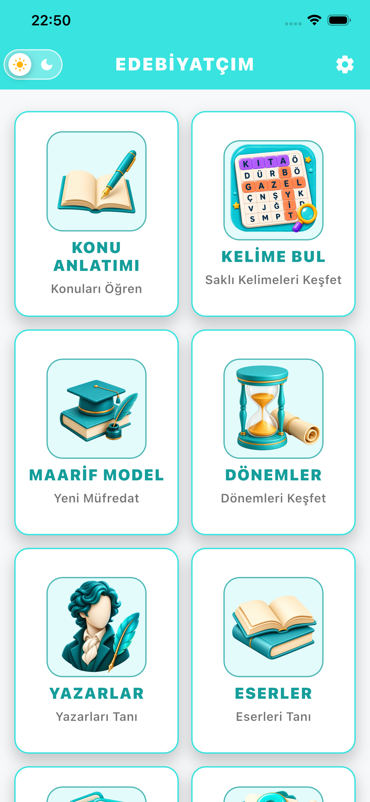
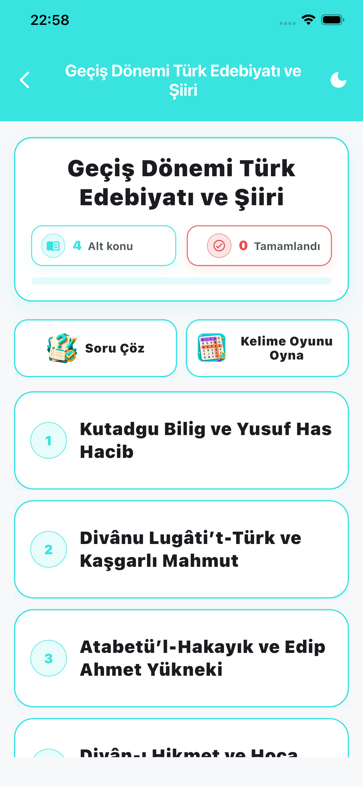
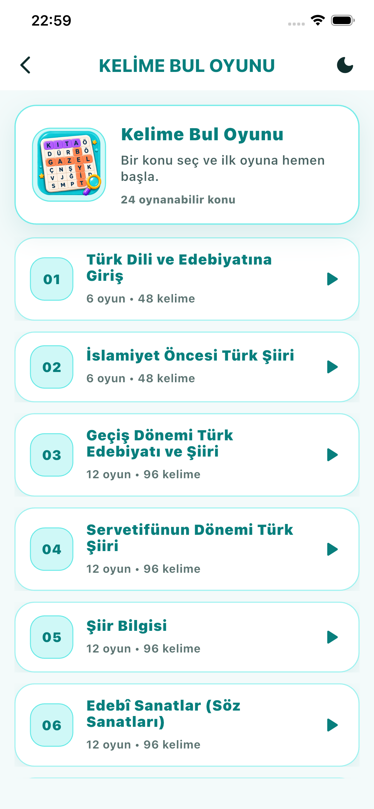
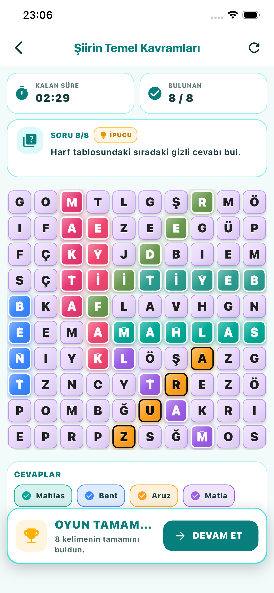
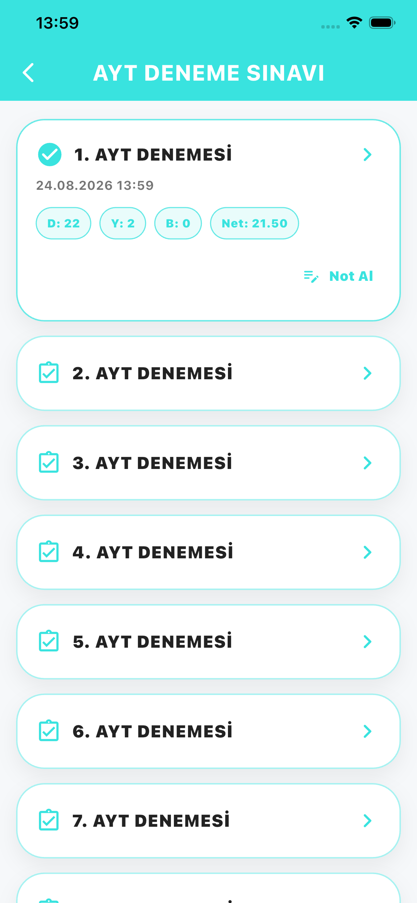
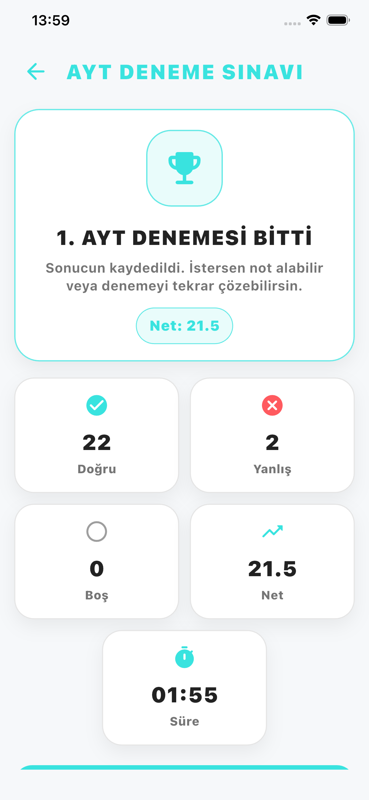
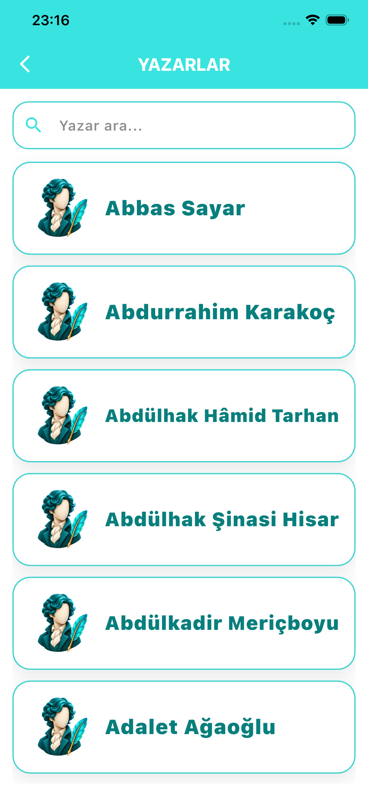
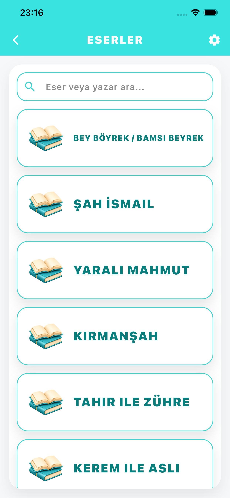

# Edebiyatçım

A comprehensive mobile learning application designed to help students prepare for the Turkish YKS/AYT Literature examination.

Edebiyatçım brings structured subject lessons, practice questions, mock exams, interactive learning tools, literary periods, authors, and works together in a single mobile experience.

> The application is currently available for Android and iOS.
> Source code is maintained in a private repository because this is a commercial project.

## Key Features

* Comprehensive Turkish Language and Literature lessons
* Content aligned with the Türkiye Yüzyılı Maarif Modeli
* 40 AYT literature mock examinations
* YKS-style practice questions
* Interactive Word Search learning game
* Literary periods, authors, and major works
* Novel summaries and study cards
* Frequently asked authors and works
* Learning progress tracking
* Light and dark theme support
* Free and Premium membership models
* Advertisement and subscription management
* Responsive layouts for phones and tablets

## Technology Stack

* Flutter and Dart
* Riverpod state management
* GoRouter navigation
* PHP REST API
* MySQL
* Firebase Analytics
* RevenueCat
* Google AdMob
* Google Play and App Store distribution

## Architecture and Development

The application uses a feature-based Flutter architecture with separated data, state-management, navigation, and presentation layers.

My responsibilities included:

* Mobile application architecture and development
* Responsive Flutter UI implementation
* REST API integration
* MySQL-backed content infrastructure
* State management with Riverpod
* Navigation with GoRouter
* Premium subscription integration
* Advertisement implementation
* Analytics integration
* Android and iOS release processes
* Store listing and product presentation

## Main Learning Modules

### Structured Lessons

Students can study literature subjects through organized main topics and subtopics, mark completed lessons, and track their progress.

### AYT Mock Examinations

The application contains 40 AYT mock examinations. Each examination includes 18 questions and a 20-minute duration.

### YKS-Style Questions

Students can reinforce their knowledge using exam-oriented questions organized by literary topic and period.

### Word Search Game

Literary concepts are transformed into an interactive word-search experience that supports enjoyable repetition and recall.

### Authors, Periods and Works

Students can explore literary periods, important authors, notable works, novel summaries, and frequently tested content.

## Platforms

* Android
* iOS

## Project Status

The application is actively maintained and its educational content, interface, games, and assessment modules continue to be improved.

## Screenshots

### Home and Structured Lessons

  
  

### Interactive Word Search

  
  

### YKS-Style Practice Questions

  
  

### Authors and Literary Works

  
  

## Developer

**Ali Aytekin**
Flutter Mobile Application Developer

* [GitHub](https://github.com/AliAytekin1)
* [LinkedIn](https://www.linkedin.com/in/aliaytekin1)

## Source Code

The source code, backend services, database structure, signing files, and production configuration are private.

This repository is intended only for project presentation and portfolio purposes.

---

© 2026 Ali Aytekin. All rights reserved.

